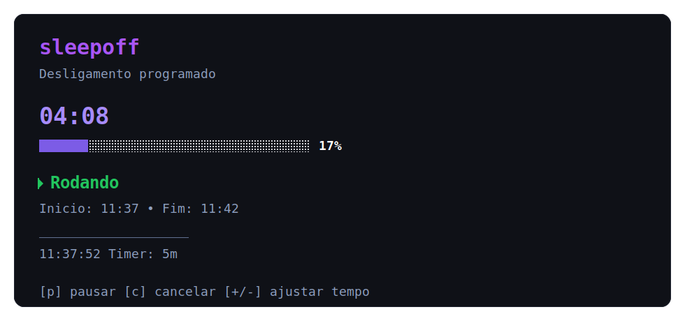

<p align="center">
  
</p>

<h1 align="center">sleepoff</h1>

<p align="center">Timer de desligamento automatico para Windows</p>

<p align="center">
  
  
  
</p>

<p align="center">
  Um CLI em Go para programar o desligamento do computador com menu interativo, modo direto por argumento,
  pausa, ajuste de tempo em runtime e uma tela final de confirmacao antes do shutdown.
</p>

##  Demo



##  Instalacao

### Windows installer

Baixe o arquivo `sleepoff-setup.exe` na pagina de releases:

- [Latest release](https://github.com/pasqualotodiogenes/sleepoff/releases/latest)

O instalador:

- copia `sleepoff.exe` para `%LocalAppData%\Programs\sleepoff\`
- adiciona esse diretorio ao `PATH` do usuario
- deixa o comando `sleepoff` disponivel no PowerShell e no CMD de qualquer pasta

Depois de instalar, feche e abra o terminal novamente.

### Zip portable

Baixe `sleepoff_windows_amd64.zip`, extraia o conteudo e use um destes fluxos:

- execucao local: `.\sleepoff.exe 90s`
- execucao global: adicione a pasta extraida ao `PATH`

### Via Go

Para desenvolvedor ou ambiente com Go instalado:

```bash
go install github.com/pasqualotodiogenes/sleepoff@latest
```

##  Primeiro uso

```bash
sleepoff --help
sleepoff 90s --dry-run
sleepoff
```

### Instalado vs binario local

Se `sleepoff` estiver instalado no `PATH`, rode normalmente:

```powershell
sleepoff 90s
```

Se voce estiver apenas com o binario na pasta atual, no PowerShell use:

```powershell
.\sleepoff.exe 90s
```

Isso acontece porque o PowerShell nao executa programas da pasta atual sem `.\` por padrao.

##  O que o app entrega

| Recurso | Como funciona |
| --- | --- |
| Menu interativo | Escolha tempos prontos com setas e `Enter`. |
| CLI direta | Rode `sleepoff 30m` sem abrir menu. |
| Pausa e retomada | Pause com `p` ou `Espaco` e retome no mesmo fluxo. |
| Ajuste em runtime | Some ou remova 5 minutos com `+` e `-`. |
| Tela de panico | Ao fim do timer, ha 10 segundos reais para cancelar. |
| Modo seguro | Use `--dry-run` para testar sem desligar a maquina. |

### Formatos aceitos

```bash
sleepoff 30
sleepoff 30m
sleepoff 90s
sleepoff 1h
sleepoff 1h30m
```

##  Controles

| Tecla | Acao |
| --- | --- |
| `p` ou `Espaco` | Pausar ou retomar |
| `+` ou `=` | Adicionar 5 minutos |
| `-` ou `_` | Remover 5 minutos |
| `c` ou `Esc` | Cancelar |

##  Build e validacao

Requisitos:

- Go `1.25+`

```bash
git clone https://github.com/pasqualotodiogenes/sleepoff.git
cd sleepoff

go test ./...
go vet ./...
go build -o sleepoff.exe .
```

### Instalar a build local no PATH do usuario

Para validar a experiencia final antes de publicar um release:

```powershell
.\scripts\install-local.ps1 -Build
sleepoff --help
```

##  Release artifacts

Cada release oficial do Windows publica:

- `sleepoff-setup.exe`
- `sleepoff_windows_amd64.zip`
- `checksums.txt`

O processo de corte de release esta documentado em [RELEASING.md](RELEASING.md).

##  Licenca

Este projeto usa a licenca MIT. O texto completo esta em [LICENSE](LICENSE).
